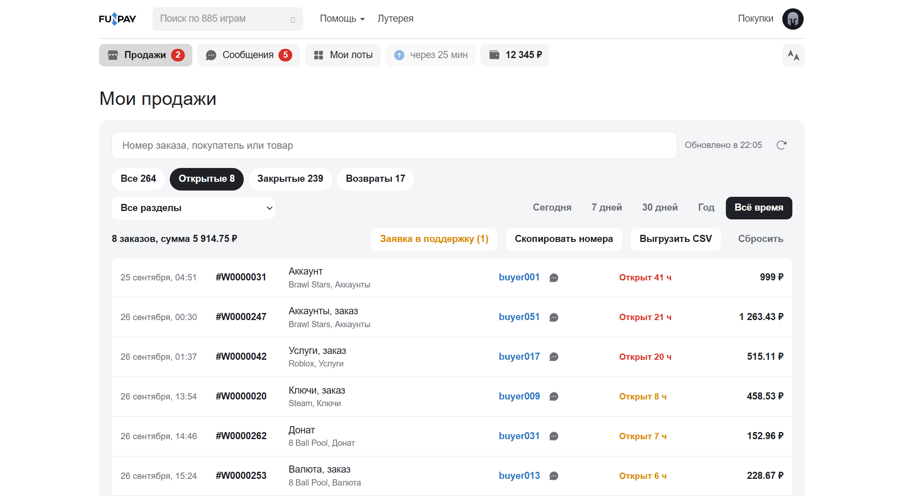
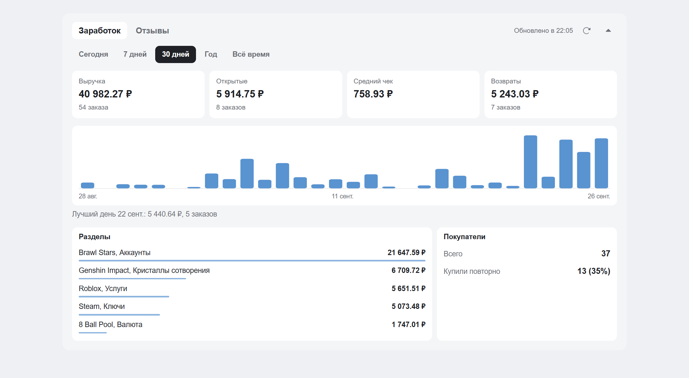
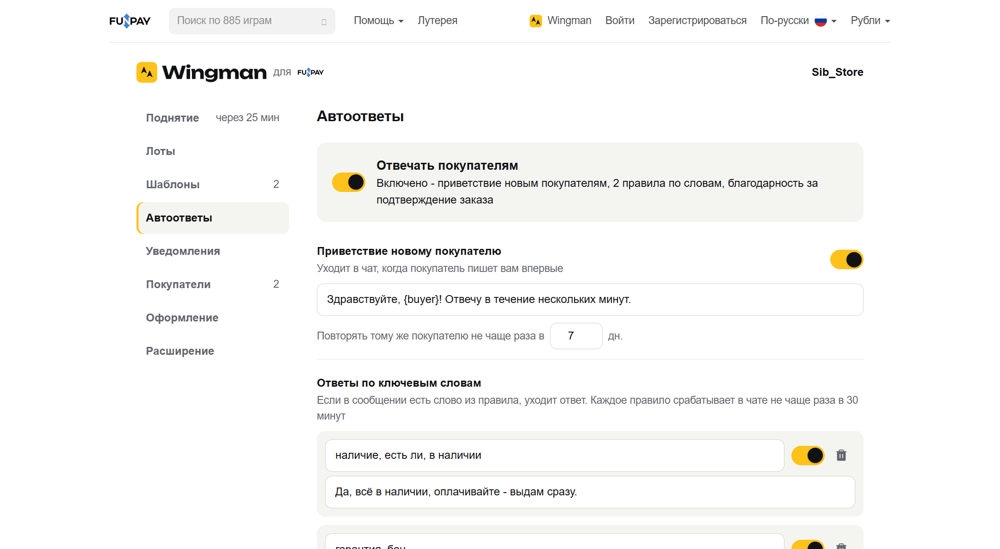
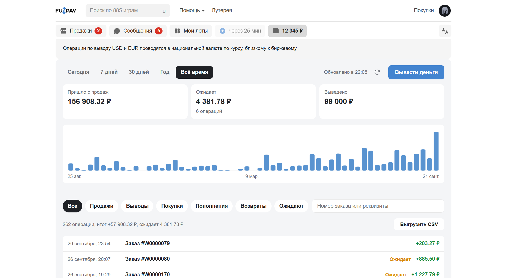

<p align="center">
  <picture>
    <source media="(prefers-color-scheme: dark)" srcset="public/brand/logo-dark.png">
    
  </picture>
</p>

<p align="center">
  Помощник продавца FunPay прямо в браузере. Открытый код, без серверов и без сбора данных.
</p>

<p align="center">
  <a href="https://github.com/sibamor/Wingman/actions/workflows/ci.yml"></a>
  <a href="LICENSE"></a>
  <a href="https://t.me/wingman_funpay"></a>
  <a href="https://discord.gg/spKJKAcuTc"></a>
</p>

Wingman встраивается в сам сайт FunPay и добавляет продавцу то, чего там не хватает. Не нужно держать отдельную программу или отдавать кому-то свой аккаунт.

<table>
  <tr>
    <td width="50%"></td>
    <td width="50%"></td>
  </tr>
  <tr>
    <td align="center">Фильтры продаж и открытые заказы</td>
    <td align="center">Заработок на своём профиле</td>
  </tr>
  <tr>
    <td width="50%"></td>
    <td width="50%"></td>
  </tr>
  <tr>
    <td align="center">Автоответы с понятными статусами</td>
    <td align="center">Финансы и операции</td>
  </tr>
</table>

<sub>Скриншоты сделаны на тестовых данных.</sub>

## Что умеет

**Лоты**
- Автоподнятие по таймеру FunPay, для каждого раздела отдельно.
- Массовая правка: цена (установить, поднять или снизить на % или ₽), наличие, включение и выключение сразу у многих лотов.
- Цена для покупателя и ваш доход с учётом комиссии раздела, себестоимость и прибыль.
- Место лота по цене в разделе и уведомление, если его перебили.
- Копия лота в один клик, английская версия описания через встроенный переводчик браузера.

**Продажи и финансы**
- Мгновенные фильтры продаж и покупок: статус, раздел, период, поиск по покупателю и товару, выгрузка в CSV.
- Аналитика на своём профиле: заработок по дням, лучшие разделы, отзывы по оценкам.
- Помощник вывода: подписи к сохранённым картам и кошелькам, логотипы банков СБП, повтор недавних выводов.
- Напоминание о невыданных заказах и итоги дня в Telegram.

**Чат**
- Шаблоны ответов с подстановкой ника и номера заказа, горячие клавиши Alt+1…9.
- Поиск по переписке: в каком чате говорили про «аккаунт с почтой».
- Заметки и метки у покупателей, закреплённые диалоги, карточка покупателя с историей заказов.
- Чёрный список покупателей.
- Предупреждение о сообщениях, которые выдают себя за администрацию FunPay.
- Подпись к скриншоту уходит вместе с картинкой.

**Автоответы и уведомления**
- Приветствие, ответы по ключевым словам, благодарность за подтверждение, ответы на отзывы, режим «Не на месте».
- Предохранители: лимит сообщений, пауза после вашего ответа, пауза при флуде.
- Уведомления о заказах, сообщениях и зачислении денег, тихие часы, дублирование в свой Telegram-бот.

**Удобство**
- Быстрый переход по Ctrl+K: разделы, заказы, покупатели.
- Избранные и недавние разделы, полоса продавца под шапкой.
- Тёмные темы и режим приватности для стримов и скриншотов.
- Подтверждение перед действиями, которые нельзя отменить.

## Ваши данные

- **Серверов у Wingman нет.** Настройки, заметки, история продаж и архив переписки хранятся только в вашем браузере.
- **Wingman обращается только к двум адресам:** `funpay.com` (те же запросы, что делает сам сайт, от вашего вошедшего аккаунта) и `api.telegram.org` (только если вы сами подключили своего бота).
- **Никакой аналитики и телеметрии.** Ничего не отправляется ни разработчикам, ни третьим лицам.
- **Пароль и `golden_key` Wingman не видит и не просит.** Расширение работает внутри открытого FunPay, как обычная вкладка.

Подробно - в [политике конфиденциальности](PRIVACY.md).

| Разрешение | Зачем |
|---|---|
| `funpay.com` | Работать на страницах FunPay и делать запросы от вашего аккаунта |
| `api.telegram.org` | Отправлять уведомления в ваш Telegram-бот, если он подключён |
| `storage` | Хранить настройки в браузере |
| `alarms` | Поднимать лоты и проверять сообщения по таймеру |
| `notifications` | Показывать системные уведомления |

Код открыт, поэтому всё это можно проверить: собрать расширение из исходников и сравнить с установленным.

## Установка

Wingman готовится к публикации в Chrome Web Store. Оттуда его можно будет поставить в Chrome, Яндекс Браузер, Opera и Edge. Новости - в [Telegram-канале](https://t.me/wingman_funpay).

До этого расширение ставится вручную:

1. Скачайте архив `wingman-*-chrome.zip` из [последнего выпуска](https://github.com/sibamor/Wingman/releases/latest) и распакуйте его.
2. Откройте `chrome://extensions` (в Edge `edge://extensions`, в Яндекс Браузере `browser://extensions`).
3. Включите «Режим разработчика» и нажмите «Загрузить распакованное».
4. Выберите распакованную папку и откройте [funpay.com/wingman](https://funpay.com/wingman).

Установленное так расширение само не обновляется: новую версию нужно поставить тем же способом.

Собрать самому:

```
git clone https://github.com/sibamor/Wingman.git
cd Wingman
npm install
npm run build
```

Готовое расширение появится в `.output/chrome-mv3`.

## Важно знать

У FunPay нет официального API. Wingman делает те же запросы, что и сайт, с паузами между ними и не обходит никаких ограничений. Но правила FunPay устанавливает FunPay: автоответы и массовые действия включайте осознанно и следите за журналом на странице настроек.

Разметка FunPay иногда меняется, и тогда отдельная функция может сломаться до следующего обновления. Если заметили - напишите в [Issues](https://github.com/sibamor/Wingman/issues) или в [Discord](https://discord.gg/spKJKAcuTc).

## Сообщество

- Новости: [t.me/wingman_funpay](https://t.me/wingman_funpay)
- Вопросы и идеи: [Discord](https://discord.gg/spKJKAcuTc)
- Ошибки и предложения: [GitHub Issues](https://github.com/sibamor/Wingman/issues)
- Уязвимости - только приватно, см. [SECURITY.md](SECURITY.md)

Хотите помочь с кодом - начните с [CONTRIBUTING.md](CONTRIBUTING.md).

## Лицензия

[GPL-3.0](LICENSE). Код можно изучать, менять и распространять. Любая изменённая версия, которую вы выпускаете, тоже должна быть с открытым кодом под этой же лицензией.

Wingman - независимый проект, он не связан с FunPay.

(кто-то навонял)
